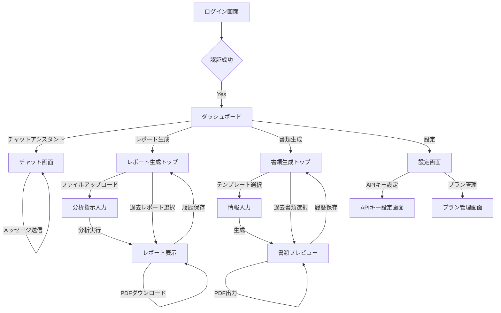

# ツミキリ MVPプロダクト仕様書

> 作成者: PdM キム・スジン
> 日付: 2026-02-15
> ステータス: 策定完了
> レビュー対象: CEO 高橋レン, CTO マルコ・ロッシ

## 1. はじめに

本ドキュメントは、TOPPA Inc.が開発する「ツミキリ」のMVP（Minimum Viable Product）におけるプロダクト仕様を詳細に定義する。CEOの四半期計画およびPdMのプロダクト企画書（docs/product-proposal.md）を基に、Founding Engineerの実装計画（docs/implementation-plan.md）との整合性を図りながら策定した。

## 2. プロダクト概要

ツミキリは、中小企業の経営者が直面する日常の事務作業の"詰み"を、AIの力で解決するWebアプリケーションである。自然言語による指示で、書類作成、データ集計、情報整理などを自動化し、経営者が本業に集中できる環境を提供する。

## 3. ターゲットユーザー

プロダクト企画書（docs/product-proposal.md）に記載のペルソナ（田中 誠一、佐藤 美咲）を主要ターゲットとする。

## 4. MVP機能詳細

MVPでは以下の3つの主要機能を実装する。

### 4.1. 機能1: AIレポート生成

#### 概要
ユーザーがCSVまたはExcelファイルをアップロードし、自然言語で分析指示を出すことで、AIがデータを分析し、日本語のレポートを生成する機能。

#### ユーザーストーリー
- 経営者として、CSVをアップロードして「今月の売上を部門別にまとめて」と指示したい。事務員に依頼する時間と手間を削減するため。
- 経営者として、AIが生成したレポートをPDF形式でダウンロードしたい。社内会議で共有するため。
- 経営者として、過去に生成したレポートを一覧で確認したい。進捗を追跡するため。
- 経営者として、機密性の高いデータも安心してアップロードしたい。データが安全に処理・保管されることを望むため。

#### 画面遷移
```
ダッシュボード → レポート生成
                  ├── ファイルアップロード画面（CSV/Excel）
                  ├── 分析指示入力画面（自然言語プロンプト）
                  └── レポート表示画面
                        ├── 生成されたレポート（Markdown/テキスト）
                        ├── PDFダウンロードボタン
                        └── 履歴へ保存
```

#### データモデル（reportsテーブル）
- `id`: UUID (Primary Key)
- `user_id`: UUID (Foreign Key to auth.users.id)
- `title`: VARCHAR(255) - レポートのタイトル
- `file_name`: VARCHAR(255) - アップロードされたファイル名
- `file_url`: TEXT - Supabase Storage上のファイルURL
- `prompt`: TEXT - ユーザーの分析指示プロンプト
- `result`: TEXT - AIが生成したレポート内容
- `status`: VARCHAR(20) - レポート生成ステータス ('pending', 'completed', 'failed')
- `created_at`: TIMESTAMPTZ
- `completed_at`: TIMESTAMPTZ

#### APIエンドポイント
- `POST /api/report/upload`: ファイルアップロード
- `POST /api/report/generate`: レポート生成要求
- `GET /api/report/:id`: 特定レポート結果取得
- `GET /api/report/list`: レポート一覧取得

### 4.2. 機能2: テンプレート書類生成

#### 概要
ユーザーが見積書や請求書などのテンプレートを選択し、自然言語またはフォーム入力で必要情報を与えることで、AIが情報をテンプレートに流し込み、書類を生成する機能。

#### ユーザーストーリー
- 経営者として、「〇〇建設さんへ、屋根修理の見積書を作って。金額は35万円」と指示したい。書類作成にかかる時間を大幅に短縮するため。
- 経営者として、AIが生成した書類をプレビューで確認してから確定したい。内容に間違いがないことを確実にしたいから。
- 経営者として、生成した書類をPDFとして出力したい。顧客にメールで送付するため。
- 経営者として、よく使うテンプレートを登録・管理したい。繰り返し利用する書類を効率的に作成するため。

#### 画面遷移
```
ダッシュボード → 書類生成
                  ├── テンプレート選択画面（見積書、請求書、お礼状など）
                  ├── 情報入力画面（自然言語 or フォーム）
                  └── プレビュー画面
                        ├── 生成された書類内容
                        ├── PDF出力ボタン
                        └── 履歴へ保存
```

#### データモデル（documentsテーブル）
- `id`: UUID (Primary Key)
- `user_id`: UUID (Foreign Key to auth.users.id)
- `template_id`: VARCHAR(50) - 使用したテンプレートのID
- `template_name`: VARCHAR(100) - テンプレート名
- `input_data`: JSONB - ユーザーが入力した情報（自然言語プロンプトやフォームデータ）
- `generated_content`: TEXT - AIが生成した書類の最終内容
- `status`: VARCHAR(20) - 書類生成ステータス ('pending', 'completed', 'failed')
- `created_at`: TIMESTAMPTZ
- `completed_at`: TIMESTAMPTZ

#### テンプレート定義（初期3種）
- `estimate`: 見積書 (必須項目: 会社名, 品目, 数量, 単価, 金額)
- `invoice`: 請求書 (必須項目: 会社名, 請求金額, 支払期限)
- `thankyou`: お礼状 (必須項目: 会社名, 顧客名)

#### APIエンドポイント
- `POST /api/document/generate`: 書類生成要求
- `GET /api/document/:id`: 特定書類結果取得
- `GET /api/document/list`: 書類一覧取得

### 4.3. 機能3: チャットアシスタント

#### 概要
経営者のあらゆる相談に対応するAIチャットインターフェース。事業に関する質問、アドバイス、文章作成など、幅広い用途で利用できる。過去の会話履歴を保持し、コンテキストを考慮した応答が可能。

#### ユーザーストーリー
- 経営者として、「この契約書の注意点を教えて」と相談したい。弁護士に聞くほどではないが、専門的な意見が欲しいから。
- 経営者として、事業に関するアドバイスをAIに求めたい。客観的な意見を聞きたいから。
- 経営者として、過去の会話履歴を参照したい。以前の相談内容を忘れてしまった場合でも、すぐに思い出せるようにするため。
- 経営者として、スマホからでもチャットを利用したい。移動中や外出先でも手軽に相談できるようにするため。

#### 画面遷移
```
ダッシュボード → チャット
                  ├── 会話履歴リスト
                  └── チャット入力・表示画面
                        ├── テキスト入力エリア
                        ├── 送信ボタン
                        └── AI応答表示
```

#### データモデル（chat_messagesテーブル）
- `id`: UUID (Primary Key)
- `user_id`: UUID (Foreign Key to auth.users.id)
- `role`: VARCHAR(10) - 'user', 'assistant', 'system'
- `content`: TEXT - メッセージ内容
- `created_at`: TIMESTAMPTZ

#### APIエンドポイント
- `POST /api/chat`: チャットメッセージ送信・AI応答取得
- `GET /api/chat/history`: 会話履歴取得
- `GET /api/chat/history/:sessionId`: 特定セッションの履歴取得

## 5. 画面遷移図（詳細版）



## 6. 非機能要件

### 6.1. パフォーマンス
- **チャット応答**: 3秒以内
- **レポート生成**: 10秒以内（ファイルサイズによる）
- **書類生成**: 5秒以内
- **初回ページロード (LCP)**: 2秒以内

### 6.2. スケーラビリティ
- 月間アクティブユーザー数1,000名まで対応可能なアーキテクチャ
- Cloudflare Workersの自動スケーリングを活用

### 6.3. セキュリティ
- **認証**: Supabase Authによるセキュアなユーザー認証
- **データ暗号化**:
    - 保存データ (at-rest): Supabaseの機能を利用
    - 通信データ (in-transit): HTTPS/TLSv1.2以上
- **アクセス制御**: RLS (Row Level Security) により、ユーザーは自身のデータのみアクセス可能
- **APIキー管理**: BYOK (Bring Your Own Key) 方式をサポートし、ユーザーAPIキーは暗号化して保存

### 6.4. 可用性
- 稼働率: 99.5%以上（月間ダウンタイム最大3.6時間）
- Cloudflare Workersのグローバル分散により高可用性を確保

### 6.5. ユーザビリティ
- **レスポンシブデザイン**: スマートフォン、タブレット、デスクトップデバイスに対応
- **直感的なUI**: ITリテラシーが中程度の経営者でも迷わず操作できるデザイン
- **エラーハンドリング**: ユーザーフレンドリーなエラーメッセージ表示

### 6.6. メンテナンス性
- クリーンアーキテクチャに基づいたコード設計
- CI/CDパイプラインを構築し、自動テストとデプロイを徹底
- ログ収集とモニタリング体制の構築

## 7. 差別化ポイント

プロダクト企画書（docs/product-proposal.md）に記載の内容と同一。

## 8. 収益モデル

プロダクト企画書（docs/product-proposal.md）に記載の内容と同一。

## 9. 成功指標

プロダクト企画書（docs/product-proposal.md）に記載の内容と同一。

## 10. 今後の計画

- 本仕様書を基に、CTOおよびFounding Engineerは技術設計・実装を進める。
- PdMはユーザーフィードバックを収集し、継続的な改善と機能拡張の計画を策定する。
