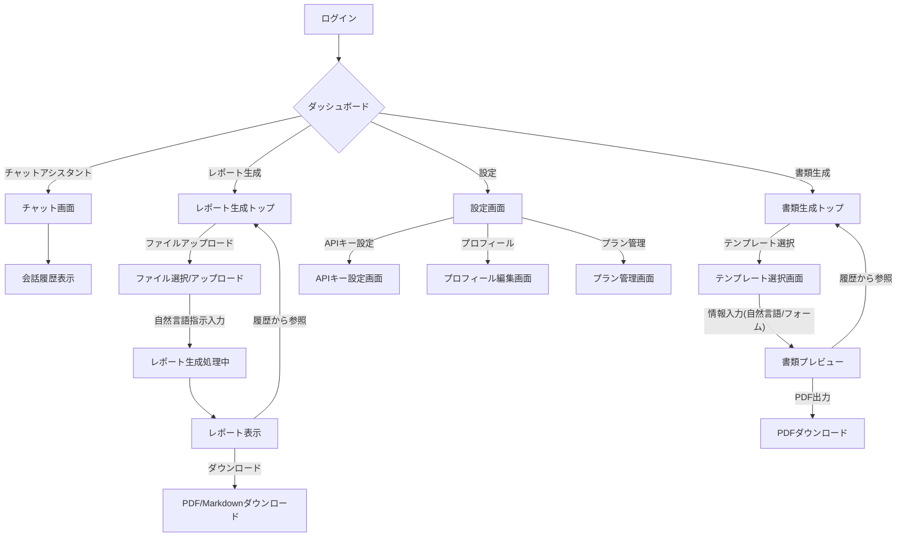

作成者: PdM キム・スジン
日付: 2026-02-15
ステータス: 策定中

# ツミキリ（Tsumikiri）— MVPプロダクト仕様書

## 1. プロダクト概要

**ツミキリ**は、中小企業の経営者が「事務作業の山」から解放されるためのAIアシスタント。自然言語で指示するだけで、日常の事務作業をAIが代行する。

## 2. ターゲットユーザー

### ペルソナ: 田中 誠一（52歳）
- **職業**: 建設業の社長（従業員12名）
- **課題**: 現場監督しながら見積書・請求書・日報管理。事務員は1人だが追いつかない
- **ITリテラシー**: LINEとExcelは使える。専門ツールは苦手
- **予算**: 月3,000円以内なら即決。1万円超えると妻（経理担当）に相談
- **口癖**: 「事務仕事さえなければ、もっと現場に出られるのに」

### ペルソナ: 佐藤 美咲（38歳）
- **職業**: 美容サロンオーナー（スタッフ5名）
- **課題**: 予約管理・顧客フォロー・SNS投稿・経理を一人でこなしている
- **ITリテラシー**: InstagramとCanvaは使いこなす。Excelは苦手
- **予算**: 効果が見えれば月5,000円OK
- **口癖**: 「やりたいことはあるのに、手が足りない」

## 3. MVP機能詳細

### 3.1. 機能1: AIレポート生成

#### 3.1.1. 機能要件
- CSVまたはExcelファイルをアップロードできる。
- 自然言語でデータ分析の指示（例: 「先月の売上を部門別にまとめて」）を受け付ける。
- AIがアップロードされたデータを分析し、指示に基づいた日本語のレポートを生成する。
- 生成されたレポートはPDFおよびMarkdown形式でダウンロード可能である。

#### 3.1.2. ユースケース
- 経営者として、CSVファイルをアップロードし、「今月の売上を商品カテゴリ別に集計して」と指示することで、手動での集計作業をなくしたい。
- 経営者として、従業員の日報Excelをアップロードし、「今週の各従業員の作業時間をまとめて」と指示することで、日報管理の手間を省きたい。

#### 3.1.3. 画面遷移
レポート生成トップ → ファイルアップロード → 指示入力 → レポート表示 → ダウンロード

#### 3.1.4. データ要件（参照: `docs/implementation-plan.md`）
- `reports` テーブル: レポート生成履歴を保存。
    - `id`: UUID (主キー)
    - `user_id`: UUID (ユーザーID、認証済みユーザーに紐付け)
    - `title`: VARCHAR(255) (レポートのタイトル)
    - `file_name`: VARCHAR(255) (アップロードされたファイル名)
    - `file_url`: TEXT (Supabase StorageへのファイルURL)
    - `prompt`: TEXT (ユーザーの指示内容)
    - `result`: TEXT (AIが生成したレポート内容)
    - `status`: VARCHAR(20) (レポート生成のステータス: pending, completed, failedなど)
    - `created_at`: TIMESTAMPTZ (作成日時)
    - `completed_at`: TIMESTAMPTZ (完了日時)

### 3.2. 機能2: テンプレート書類生成

#### 3.2.1. 機能要件
- 見積書、請求書、お礼状などのテンプレートが用意されている。
- 自然言語（例: 「○○建設さんへ、屋根修理の見積書を作って。金額は35万円」）またはフォーム入力で、書類に必要な情報を入力できる。
- AIが入力された情報とテンプレートを組み合わせて書類を自動生成する。
- 生成された書類はPDF形式で出力可能である。

#### 3.2.2. ユースケース
- 経営者として、「株式会社△△へ、先月のコンサルティング費用100万円の請求書を今月末支払いで作成して」と指示することで、請求書作成の手間を大幅に削減したい。
- 経営者として、顧客へのお礼状テンプレートを選択し、顧客名と感謝のメッセージを入力することで、迅速に丁寧な対応をしたい。

#### 3.2.3. 画面遷移
書類生成トップ → テンプレート選択 → 情報入力（自然言語/フォーム） → プレビュー → PDF出力

#### 3.2.4. データ要件（参照: `docs/implementation-plan.md`）
- `documents` テーブル: 生成済み書類の履歴を保存。
    - `id`: UUID (主キー)
    - `user_id`: UUID (ユーザーID、認証済みユーザーに紐付け)
    - `template_id`: VARCHAR(50) (使用したテンプレートのID)
    - `template_name`: VARCHAR(100) (使用したテンプレートの名前)
    - `input_data`: JSONB (ユーザーが入力した情報)
    - `generated_content`: TEXT (AIが生成した書類内容)
    - `status`: VARCHAR(20) (書類生成のステータス: pending, completed, failedなど)
    - `created_at`: TIMESTAMPTZ (作成日時)
    - `completed_at`: TIMESTAMPTZ (完了日時)

### 3.3. 機能3: チャットアシスタント

#### 3.3.1. 機能要件
- 経営者向けの何でも聞けるAIチャットインターフェースを提供する。
- 事業に関する質問、アドバイス、文章作成依頼などに対応する。
- 過去の会話履歴を保持し、コンテキストを理解した上で応答する。
- 経営者の"詰み"に特化したシステムプロンプトが適用されている。

#### 3.3.2. ユースケース
- 経営者として、「新しい事業アイデアについて壁打ちしたい」とAIに相談することで、多角的な視点からのフィードバックを得たい。
- 経営者として、「従業員に送るモチベーションアップのメッセージを作成して」と依頼することで、効果的なコミュニケーションをサポートしてもらいたい。
- 経営者として、「この契約書のここで不明な点があるんだけど、どういう意味？」と質問することで、法務の専門家に依頼する前に疑問を解消したい。

#### 3.3.3. 画面遷移
ダッシュボード → チャット画面 → 会話履歴表示

#### 3.3.4. データ要件（参照: `docs/implementation-plan.md`）
- `chat_messages` テーブル: 会話履歴を保存。
    - `id`: UUID (主キー)
    - `user_id`: UUID (ユーザーID、認証済みユーザーに紐付け)
    - `role`: VARCHAR(10) (メッセージの送信者: user, assistant, system)
    - `content`: TEXT (メッセージの内容)
    - `created_at`: TIMESTAMPTZ (作成日時)

## 4. ユーザーストーリー

1.  経営者として、CSVをアップロードして「今月の売上まとめて」と指示したい。事務員に頼むよりも早く、正確に、手間なくレポートを得たいため。
2.  経営者として、「○○社に見積書を送って。内容は屋根修理で35万円」と指示したい。書類作成に30分かかっていた時間を3分に短縮し、本業に集中したいため。
3.  経営者として、「この契約書の注意点を教えて」と相談したい。弁護士に依頼するほどではないが、法的なリスクを事前に把握し、不安を解消したいため。
4.  経営者として、スマホからでもツミキリを操作したい。現場移動中や出張先など、場所を選ばずに事務作業を完了させたいため。
5.  経営者として、自分のAPIキーを使いたい。AI利用のコストを自分でコントロールし、費用対効果を最大化したいため。
6.  経営者として、過去に作成した書類をキーワードで検索したい。「先月の○○社の見積書どこだっけ？」と探す時間をなくし、必要な情報にすぐにアクセスしたいため。
7.  経営者として、日報を音声で入力したい。キーボード入力が苦手なため、移動中や作業中でも手軽に情報を記録したいため。（将来的な拡張機能だが、ニーズとして記録）
8.  経営者として、AIが作った書類を最終確認してから確定したい。誤字脱字や金額の間違いは会社の信用問題に関わるため、最終的な責任は自分で持ちたいため。
9.  経営者として、月額の利用料を事前に知りたい。予算オーバーを避け、安心してサービスを利用したいため。
10. 経営者として、データが安全に管理されていると安心したい。顧客情報や機密情報を扱うため、情報漏洩のリスクを最小限に抑えたい。
11. 経営者として、AIレポートの結果をPDFだけでなくMarkdown形式でもダウンロードしたい。他の資料に転用したり、編集したりしやすいため。
12. 経営者として、チャットアシスタントとの過去の会話履歴を参照したい。以前のアドバイスや情報に基づいて、継続的に事業判断を行いたいため。

## 5. 画面遷移図

## 6. データモデル概要（参照: `docs/implementation-plan.md`）

PdMの視点から、主要なデータエンティティとその役割を以下にまとめる。詳細なスキーマはFounding Engineerの成果物を参照のこと。

-   **ユーザー (auth.users)**: サービスを利用する経営者。認証情報と紐付けられる。
-   **チャットメッセージ (chat_messages)**: ユーザーとAIアシスタント間の会話履歴。
-   **レポート (reports)**: ユーザーが生成を依頼したAIレポートに関する情報と結果。
-   **書類 (documents)**: ユーザーが生成を依頼したテンプレートベースの書類情報と結果。
-   **ユーザー設定 (user_settings)**: 各ユーザー固有の設定（例: APIキー）。

## 7. 非機能要件

-   **レスポンス**:
    -   チャット応答: 3秒以内
    -   レポート生成: 10秒以内
    -   書類生成: 5秒以内
-   **可用性**: 99.5%以上
-   **セキュリティ**: データ暗号化（at-rest, in-transit）、SOC2準拠を目指す
-   **対応ブラウザ**: Chrome, Safari, Edge（最新2バージョン）
-   **スマホ**: iOS Safari, Android Chrome 対応