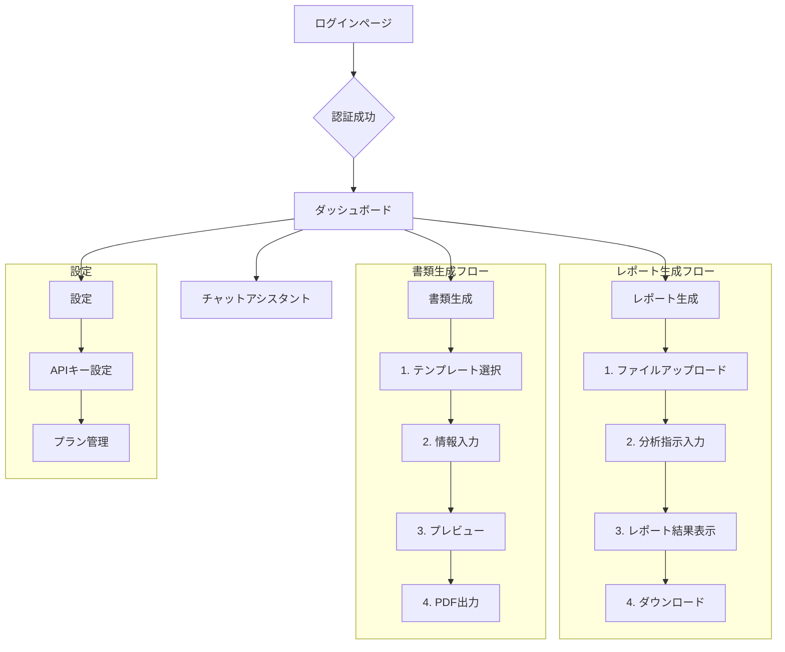

# ツミキリ — MVPプロダクト仕様書

- 作成者: PdM キム・スジン
- 日付: 2026-02-15
- ステータス: 作成中

## 1. 概要

本ドキュメントは、中小企業経営者向けの事務効率化AI「ツミキリ」のMVP（Minimum Viable Product）に関する仕様を定義するものです。Q1計画に基づき、ユーザーに価値を届ける最小限の機能セットを規定します。

## 2. ターゲットユーザー

| ペルソナ | 職業 | 主要な課題 |
|---|---|---|
| 田中 誠一（52歳） | 建設業の社長（従業員12名） | 現場監督と事務作業の両立。見積書・請求書作成に時間がかかる。 |
| 佐藤 美咲（38歳） | 美容サロンオーナー（スタッフ5名）| 予約管理、顧客フォロー、SNS投稿、経理などワンオペでの業務過多。 |

## 3. MVP機能一覧

CEOの四半期計画およびCTOの実装計画に基づき、以下の3機能をMVPとして定義します。実装優先度順に記載します。

| 優先度 | 機能 | 概要 | 解決する"詰み" |
|---|---|---|---|
| 1 | チャットアシスタント | 経営に関する壁打ちや情報収集ができるAIチャット | 孤独な意思決定、情報収集の手間 |
| 2 | AIレポート生成 | CSV/Excelをアップロードし、自然言語でデータ集計・分析を指示 | データ集計・日報まとめの工数 |
| 3 | テンプレート書類生成 | 自然言語の指示で見積書や請求書などの定型書類を即座に作成 | 書類作成の反復作業 |

## 4. 機能仕様詳細

### 4.1. チャットアシスタント (Priority 1)

#### 4.1.1. 目的
経営者が事業に関する相談やアイデアの壁打ち、情報収集を手軽に行えるようにする。思考の整理と意思決定の迅速化を支援する。

#### 4.1.2. ユーザーストーリー
- 経営者として、事業の新しいアイデアについてAIに壁打ちし、客観的な意見が欲しい。
- 経営者として、「この契約書の注意点を教えて」と相談したい。弁護士に聞くほどでもないが不安だから。
- 経営者として、部下へのフィードバック面談の話し方を相談したい。

#### 4.1.3. 主要な画面要素とフロー
**画面: ダッシュボード**
1.  **チャット入力エリア:** ユーザーがメッセージを入力するテキストエリア。
2.  **送信ボタン:** メッセージを送信する。
3.  **会話履歴エリア:** ユーザーとAIの会話が時系列で表示される。
4.  **新規チャットボタン:** 現在の会話をリセットし、新しいセッションを開始する。

**ユーザーフロー:**
1.  ユーザーがダッシュボードにアクセスする。
2.  チャット入力エリアに相談内容を入力し、送信ボタンを押す。
3.  会話履歴エリアにユーザーのメッセージが追加され、AIの応答がストリーミングで表示される。
4.  過去の会話は自動で保存され、次回ログイン時にも表示される。

#### 4.1.4. データモデル
CTOの設計に基づき、以下のデータを管理する。
- **テーブル:** `chat_messages`
- **主要カラム:** `id`, `user_id`, `role`, `content`, `created_at`

### 4.2. AIレポート生成 (Priority 2)

#### 4.2.1. 目的
手作業で行われている売上集計や日報のまとめ作業を自動化し、経営者がデータに基づいた迅速な状況把握をできるようにする。

#### 4.2.2. ユーザーストーリー
- 経営者として、複数店舗の売上CSVをアップロードして「今月の店舗別売上トップ3をまとめて」と指示したい。事務員に頼む手間を省くため。
- 経営者として、営業チームの日報Excelをアップロードし、「各メンバーの今週の訪問件数をグラフにして」と指示したい。

#### 4.2.3. 主要な画面要素とフロー
**画面: レポート生成ページ**
1.  **ファイルアップロードエリア:** CSVまたはExcelファイルをドラッグ＆ドロップまたは選択してアップロードする。
2.  **指示入力エリア:** アップロードしたファイルに対して、どのような集計や分析をしたいか自然言語で入力する。
3.  **生成ボタン:** レポート生成を開始する。
4.  **レポート表示エリア:** 生成されたレポート（テキスト、表、グラフ）が表示される。
5.  **ダウンロードボタン:** レポートをMarkdown形式またはPDF形式でダウンロードする。

**ユーザーフロー:**
1.  ユーザーがナビゲーションから「レポート生成」ページに遷移する。
2.  ファイルアップロードエリアに分析したいファイルをアップロードする。
3.  指示入力エリアに「先月の売上を部門別にまとめて」などと入力し、生成ボタンを押す。
4.  処理中であることが表示され、完了後にレポート表示エリアに結果が表示される。
5.  ユーザーは結果を確認し、必要に応じてダウンロードボタンを押す。

#### 4.2.4. 技術要件
- **対応ファイル形式:** CSV, XLSX
- **ファイルサイズ上限:** 5MB
- **データ保持:** アップロードされたファイルはレポート生成後にサーバから削除する。生成されたレポート結果は履歴として保存する。

#### 4.2.5. データモデル
CTOの設計に基づき、以下のデータを管理する。
- **テーブル:** `reports`
- **主要カラム:** `id`, `user_id`, `title`, `prompt`, `result`, `status`, `created_at`

### 4.3. テンプレート書類生成 (Priority 3)

*（注: 本日のスコープ外。2026-02-17までに詳細化予定）*

## 5. 画面遷移図

プロダクト企画書で定義した遷移図をMermaid記法で詳細化する。

## 6. 非機能要件

| 項目 | 要件 |
|---|---|
| パフォーマンス | チャット応答: 3秒以内、レポート生成: 30秒以内 |
| 対応ブラウザ | Chrome, Safari, Edge（最新2バージョン） |
| レスポンシブ | スマートフォン（iOS, Android）での主要機能の利用が可能であること |
| セキュリティ | アップロードされたファイルは処理後即時削除。DBに保存されるデータは暗号化する |
