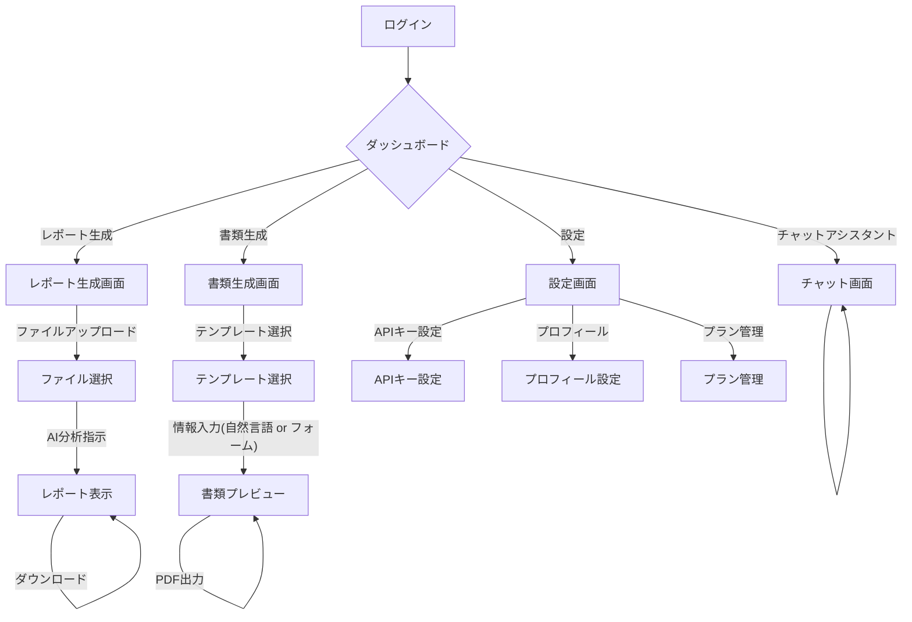

# ツミキリ（Tsumikiri）— MVPプロダクト仕様書

> 作成: PdM キム・スジン
> 日付: 2026-02-15
> ステータス: 詳細化完了
> レビュー: CEO 高橋レン

## 1. プロダクト概要

**ツミキリ**は、中小企業の経営者が「事務作業の山」から解放されるためのAIアシスタント。自然言語で指示するだけで、日常の事務作業をAIが代行する。

### 名前の由来

「詰み」を「切り開く」→ ツミキリ。経営者の"詰み"状態を突破するという意味。

## 2. ターゲットユーザー

### ペルソナ: 田中 誠一（52歳）
- **職業**: 建設業の社長（従業員12名）
- **課題**: 現場監督しながら見積書・請求書・日報管理。事務員は1人だが追いつかない
- **ITリテラシー**: LINEとExcelは使える。専門ツールは苦手
- **予算**: 月3,000円以内なら即決。1万円超えると妻（経理担当）に相談
- **口癖**: 「事務仕事さえなければ、もっと現場に出られるのに」

### ペルソナ: 佐藤 美咲（38歳）
- **職業**: 美容サロンオーナー（スタッフ5名）
- **課題**: 予約管理・顧客フォロー・SNS投稿・経理を一人でこなしている
- **ITリテラシー**: InstagramとCanvaは使いこなす。Excelは苦手
- **予算**: 効果が見えれば月5,000円OK
- **口癖**: 「やりたいことはあるのに、手が足りない」

## 3. 解決する"詰み"

| 詰みの種類 | 具体例 | ツミキリの解決方法 |
|-----------|--------|------------------|
| 書類作成の山 | 見積書・請求書・契約書 | テンプレート + AI自動生成 |
| データ集計 | 売上集計・日報まとめ | CSV/Excelアップロード → AI分析 |
| メール対応 | 問い合わせ・フォローアップ | AIが下書き生成 → 確認して送信 |
| 情報整理 | 会議メモ・タスク管理 | 自然言語で入力 → 自動整理 |

## 4. MVP機能詳細（3つに絞る）

### 機能1: AIレポート生成
- **概要**: アップロードされたCSVまたはExcelファイルをAIが分析し、自然言語の指示に基づいたレポートを生成する。
- **機能要件**:
    - ユーザーはCSVまたはExcelファイルをウェブUIからアップロードできる。
    - ユーザーは「先月の売上を部門別にまとめて」のように自然言語で分析指示を入力できる。
    - AIはアップロードされたデータと指示に基づき、分析結果を日本語のレポートとして生成する。
    - 生成されたレポートはウェブUIで表示され、PDFまたはMarkdown形式でダウンロードできる。
    - レポート生成の履歴はユーザーごとに保存・閲覧できる。
- **関連APIエンドポイント（Founding Engineerの実装計画より）**:
    - `POST /api/report/upload`: ファイルアップロード
    - `POST /api/report/generate`: レポート生成要求
    - `GET /api/report/:id`: 特定レポート結果取得
    - `GET /api/report/list`: レポート一覧取得
- **データモデル（Founding Engineerの実装計画より）**: `reports`テーブル (id, user_id, title, file_name, file_url, prompt, result, status, created_at, completed_at)

### 機能2: テンプレート書類生成
- **概要**: 定義済みのテンプレート（見積書、請求書、お礼状など）を選択し、自然言語で必要な情報を入力することで、AIが自動的に書類を生成する。
- **機能要件**:
    - ユーザーは用意されたテンプレートリストから書類の種類を選択できる。
    - ユーザーは「○○建設さんへ、屋根修理の見積書を作って。金額は35万円」のように自然言語で書類作成に必要な情報を入力できる。
    - AIは入力された情報とテンプレートを組み合わせて、指定された書類を生成する。
    - 生成された書類はプレビュー表示でき、PDF形式で出力できる。
    - 生成された書類の履歴はユーザーごとに保存・閲覧できる。
- **データモデル（Founding Engineerの実装計画より）**: `documents`テーブル (id, user_id, template_id, template_name, input_data, generated_content, status, created_at, completed_at)
- **初期テンプレート**: 見積書 (estimate), 請求書 (invoice), お礼状 (thankyou)

### 機能3: チャットアシスタント
- **概要**: 経営者の"詰み"に特化したAIチャットインターフェースを提供し、事業に関する質問、アドバイス、文章作成など、多岐にわたるサポートを行う。
- **機能要件**:
    - ユーザーはテキスト入力でAIと対話できる。
    - AIは経営者の質問に対し、的確なアドバイスや情報を提供する。
    - AIは文章作成（メール下書き、SNS投稿文など）をサポートする。
    - 過去の会話履歴は自動的に保存され、コンテキストとして利用される。
    - ユーザーは過去の会話履歴を閲覧・検索できる。
- **関連APIエンドポイント（Founding Engineerの実装計画より）**:
    - `POST /api/chat`: チャット送信・AI応答取得
    - `GET /api/chat/history`: 会話履歴取得
    - `GET /api/chat/history/:sessionId`: 特定セッションの履歴取得
- **データモデル（Founding Engineerの実装計画より）**: `chat_messages`テーブル (id, user_id, role, content, created_at)

## 5. ユーザーストーリー

1.  経営者として、CSVをアップロードして「今月の売上まとめて」と言いたい。事務員に頼む手間を省くため。
2.  経営者として、「○○社に見積書を送って」と言いたい。書類作成に30分かかるのを3分にするため。
3.  経営者として、「この契約書の注意点を教えて」と相談したい。弁護士に聞くほどでもないが不安だから。
4.  経営者として、スマホからでも操作したい。現場や移動中に使うため。
5.  経営者として、自分のAPIキーを使いたい。コストを自分でコントロールするため。
6.  経営者として、過去の書類やレポートを検索したい。「先月の○○社の見積書どこだっけ？」をなくすため。
7.  経営者として、日報を音声で入力したい。キーボードが苦手だから。
8.  経営者として、AIが作った書類をプレビューしてから確定したい。間違いがあると信用問題だから。
9.  経営者として、月額の利用料を事前に知りたい。予算オーバーが怖いから。
10. 経営者として、データが安全に管理されていると安心したい。顧客情報を扱うから。

## 6. 画面遷移

**画面遷移補足**:
- ダッシュボードから各機能へアクセス。
- チャット画面では継続的な対話が可能。
- レポート生成画面ではファイルアップロード後、AI分析指示を行い、生成されたレポートを閲覧・ダウンロード。
- 書類生成画面ではテンプレート選択後、情報入力（自然言語またはフォーム）を経てプレビュー、PDF出力。
- 設定画面ではAPIキー、プロフィール、プラン管理が可能。

## 7. 非機能要件

- **レスポンス**:
    - チャット応答: 3秒以内 (Founding Engineerのパフォーマンス要件より)
    - レポート生成: 10秒以内 (Founding Engineerのパフォーマンス要件より)
    - 書類生成: 5秒以内 (Founding Engineerのパフォーマンス要件より)
- **可用性**: 99.5%以上
- **セキュリティ**:
    - データ暗号化（at-rest, in-transit）
    - ユーザー認証と認可 (Supabase AuthによるROW LEVEL SECURITY)
    - SOC2準拠を目指す
- **スケーラビリティ**: Cloudflare WorkersとSupabaseによるサーバーレスアーキテクチャでユーザー数増加に対応
- **対応ブラウザ**: Chrome, Safari, Edge（最新2バージョン）
- **スマホ対応**: iOS Safari, Android Chrome 対応（レスポンシブUI）
- **データ保持**: Proプランユーザーは90日間、Freeプランユーザーは30日間（仮）

## 8. 差別化ポイント

| 競合 | ツミキリの優位性 |
|------|-----------------|
| ChatGPT / Claude | 経営者特化のUI。書類テンプレート。データ管理機能 |
| freee / マネーフォワード | AI自然言語操作。会計以外の事務も対応 |
| 事務代行サービス | 月額¥2,980で24時間対応。人件費の1/10以下 |

## 9. 収益モデル

| プラン | 価格 | 内容 |
|--------|------|------|
| Free | ¥0 | 月10タスク、基本テンプレート3種、データ保持30日 |
| Pro | ¥2,980/月 | 無制限タスク、全テンプレート、データ保持90日 |
| BYOK | ¥0（APIキー自前） | Pro機能利用可、API費用は自己負担 |

## 10. 成功指標

- ローンチ1ヶ月: ユーザー登録100名、有料転換5名
- ローンチ3ヶ月: ユーザー登録500名、有料転換25名、MRR ¥74,500
- NPS: 40以上（経営者からの推薦意向）

## 11. 主要データモデル概要（Founding Engineerの実装計画より）

- **`chat_messages`**:
    - 用途: ユーザーとAIの会話履歴を保存。
    - 項目: `id`, `user_id`, `role` (user/assistant/system), `content`, `created_at`

- **`reports`**:
    - 用途: AIレポート生成機能で生成されたレポートの履歴と関連情報を保存。
    - 項目: `id`, `user_id`, `title`, `file_name`, `file_url`, `prompt`, `result` (レポート内容), `status`, `created_at`, `completed_at`

- **`documents`**:
    - 用途: テンプレート書類生成機能で生成された書類の履歴と関連情報を保存。
    - 項目: `id`, `user_id`, `template_id`, `template_name`, `input_data` (自然言語入力などのJSON), `generated_content` (生成された書類内容), `status`, `created_at`, `completed_at`

- **`user_settings`**:
    - 用途: ユーザーごとの設定情報（例: BYOK用のAPIキー）を保存。
    - 項目: `id`, `user_id`, `setting_key`, `setting_value`, `created_at`, `updated_at`
