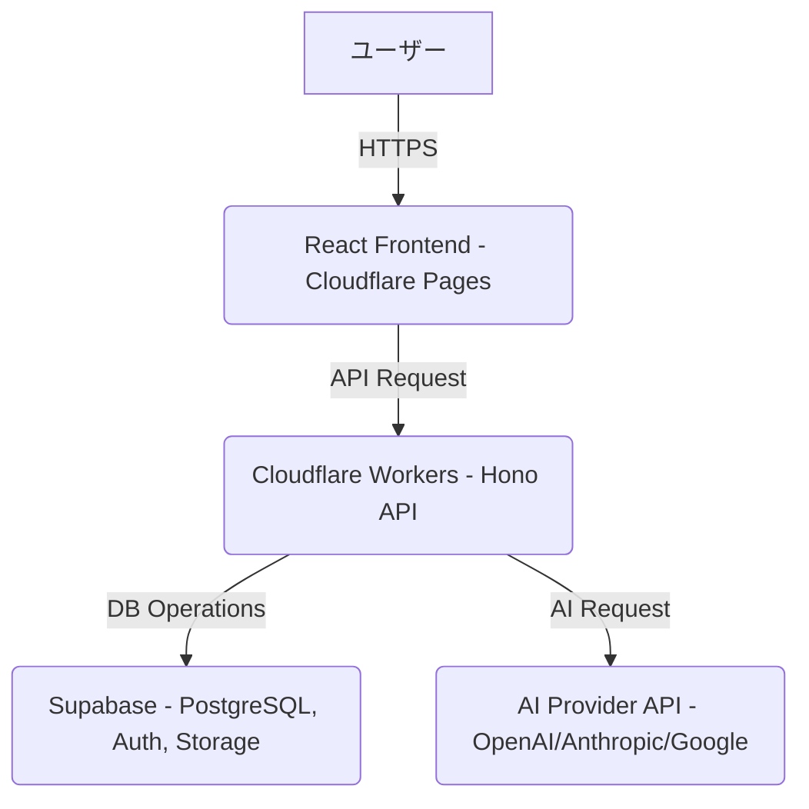
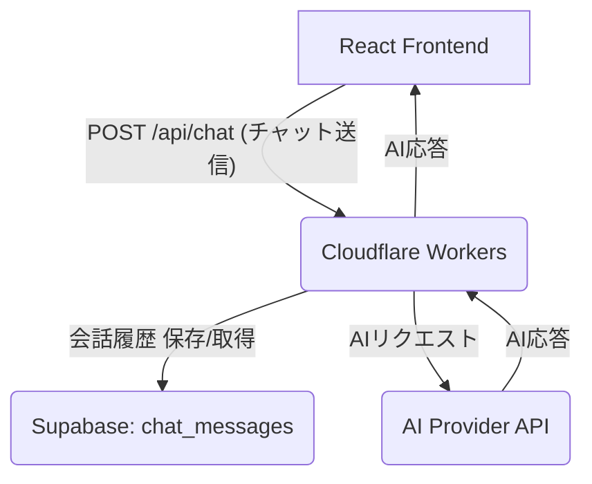
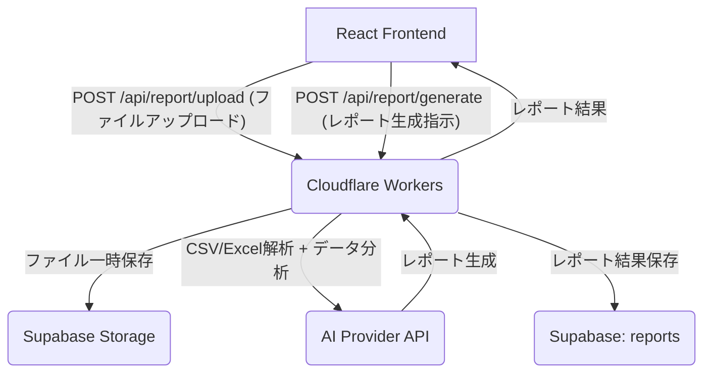

# ツミキリ 技術アーキテクチャ設計書

> 作成: CTO マルコ・ロッシ
> 日付: 2026-02-16
> ステータス: ドラフト作成完了
> レビュー: CEO 高橋レン

## 1. 概要

本ドキュメントは、TOPPA Inc. の第1弾プロダクトである「ツミキリ」の技術アーキテクチャ設計を定義する。PdMのプロダクト仕様書とFounding Engineerの実装計画に基づき、システム構成、API設計、BYOK実装方針、セキュリティ要件を明確にする。

## 2. システム構成

ツミキリは、フロントエンドにReact、バックエンドにCloudflare Workers、データベースにSupabase、AIプロバイダーとしてOpenAI/Anthropic/Google APIを使用する。

### 2.1. チャットアシスタント機能のシステム構成

### 2.2. AIレポート生成機能のシステム構成

## 3. API設計

Founding Engineerの実装計画に基づき、主要なAPIエンドポイントを定義する。

### 3.1. 認証・認可関連API

| エンドポイント | Method | 機能 | 認証要件 |
|---------------|--------|------|----------|
| `/api/auth/login` | POST | ユーザーログイン | なし |
| `/api/auth/register` | POST | ユーザー登録 | なし |
| `/api/auth/logout` | POST | ユーザーログアウト | 必須 (JWT) |
| `/api/auth/session` | GET | 現在のセッション情報取得 | 必須 (JWT) |

### 3.2. チャットアシスタント関連API

| エンドポイント | Method | 機能 | 認証要件 |
|---------------|--------|------|----------|
| `/api/chat` | POST | チャット送信・AI応答取得 | 必須 (JWT) |
| `/api/chat/history` | GET | 会話履歴取得 | 必須 (JWT) |
| `/api/chat/history/:sessionId` | GET | 特定セッションの履歴取得 | 必須 (JWT) |

### 3.3. AIレポート生成関連API

| エンドポイント | Method | 機能 | 認証要件 |
|---------------|--------|------|----------|
| `/api/report/upload` | POST | ファイルアップロード（CSV/Excel） | 必須 (JWT) |
| `/api/report/generate` | POST | AIによるデータ分析・レポート生成 | 必須 (JWT) |
| `/api/reports` | GET | 生成済みレポート一覧取得 | 必須 (JWT) |
| `/api/reports/:reportId` | GET | 特定レポート詳細取得 | 必須 (JWT) |

## 4. BYOK実装方針

ユーザーが自身のAIプロバイダーAPIキー（OpenAI, Anthropic, Google）を使用できるBYOK (Bring Your Own Key) 方式をサポートする。

- **キーの保存**: ユーザーから提供されたAPIキーは、Supabaseの暗号化されたカラムに保存される。Row Level Security (RLS) により、各ユーザーは自身のキーのみにアクセス可能とする。
- **キーの利用**: Cloudflare WorkersがAIプロバイダーAPIを呼び出す際に、ユーザーのAPIキーを一時的にメモリ上で利用する。リクエスト完了後、メモリから破棄し、ログには記録しない。
- **セキュリティ**: APIキーはサーバーサイドで直接利用され、クライアントサイドには決して公開されない。

## 5. セキュリティ要件

TOPPA Inc.全体の技術方針書 (`docs/tech-direction.md`) に基づき、ツミキリプロダクトに特化したセキュリティ要件を定義する。

### 5.1. データ保護

- **通信**: フロントエンドとバックエンド間の通信、およびバックエンドとAIプロバイダー/Supabase間の通信は全てTLS 1.3で暗号化する。
- **保存データ**: Supabaseに保存されるユーザーデータ（会話履歴、レポート結果、APIキーなど）はAES-256で暗号化される。
- **ファイルストレージ**: Supabase Storageにアップロードされるファイルは、適切なアクセス制御（RLS）を適用し、ユーザーごとに分離する。

### 5.2. 認証・認可

- **ユーザー認証**: Supabase Authを利用し、メールアドレス/パスワード認証およびソーシャルログイン（Google, GitHubなど）をサポートする。
- **API認証**: 全ての保護されたAPIエンドポイントはJWT (JSON Web Token) による認証を必須とする。JWTはSupabase Authによって発行・検証される。
- **認可 (RLS)**: SupabaseのRow Level Security (RLS) を積極的に活用し、ユーザーは自身のデータのみにアクセスできるよう厳格に制御する。`chat_messages`テーブルや`reports`テーブルには、`auth.uid() = user_id`のポリシーを適用する。

### 5.3. BYOKセキュリティ

- ユーザーのAPIキーは、Cloudflare Workersのシークレット管理機能とSupabaseの暗号化を組み合わせて安全に管理する。
- APIキーは、AIプロバイダーへのリクエスト時のみ一時的に利用し、ログに記録せず、メモリから即座に破棄する。

## 6. 今後の課題・検討事項

- **エラーハンドリング**: AIプロバイダーAPIからのエラーやSupabaseのエラーに対する堅牢なエラーハンドリング戦略。
- **レートリミット**: AIプロバイダーAPIのレートリミット超過に対する対策（リトライメカニズムなど）。
- **モニタリング**: システムのパフォーマンス、エラー発生状況、セキュリティイベントを監視する仕組み。