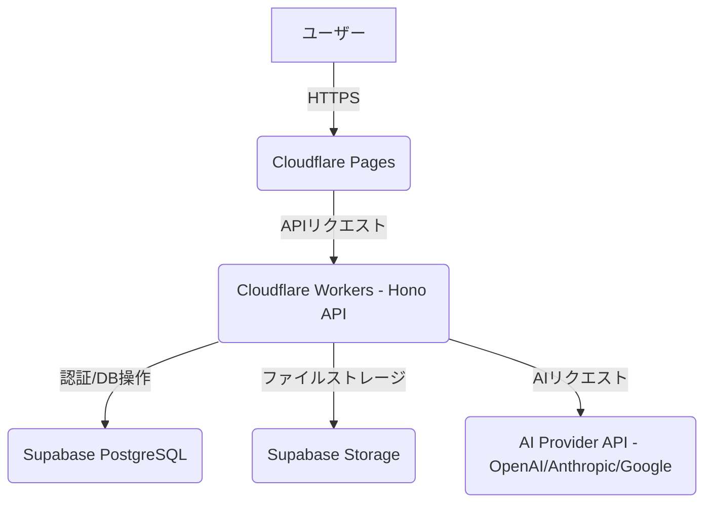

# ツミキリ 技術アーキテクチャ設計書

> 作成: CTO マルコ・ロッシ
> 日付: 2026-02-15
> ステータス: 設計完了

## 1. システム構成

ツミキリのシステム構成は、高速性、スケーラビリティ、開発効率を重視し、CloudflareとSupabaseを基盤とするサーバーレスアーキテクチャを採用する。



## 2. API設計

Cloudflare Workers (Hono) を用いて、以下のAPIエンドポイントを提供する。Founding Engineerの実装計画に基づき、チャット、レポート生成、テンプレート書類生成の各機能に対応する。

### 2-1. チャットアシスタントAPI

| エンドポイント | Method | 機能 | 備考 |
|---------------|--------|------|------|
| `/api/chat` | POST | チャット送信・AI応答取得 | ユーザーからのメッセージをAIに渡し、応答を返す。会話履歴はSupabaseに保存。 |
| `/api/chat/history` | GET | 会話履歴取得 | ログインユーザーの全会話履歴を取得。 |
| `/api/chat/history/:sessionId` | GET | 特定セッションの履歴取得 | 特定のチャットセッションの会話履歴を取得。 |

### 2-2. AIレポート生成API

| エンドポイント | Method | 機能 | 備考 |
|---------------|--------|------|------|
| `/api/report/generate` | POST | レポート生成 | CSV/Excelファイルをアップロードし、自然言語の指示に基づきAIが分析・レポート生成。 |
| `/api/report/history` | GET | レポート履歴取得 | ログインユーザーの全レポート生成履歴を取得。 |
| `/api/report/:reportId` | GET | 特定レポート詳細取得 | 特定のレポートの詳細と生成結果を取得。 |

### 2-3. テンプレート書類生成API

| エンドポイント | Method | 機能 | 備考 |
|---------------|--------|------|------|
| `/api/document/generate` | POST | 書類生成 | テンプレートと入力データに基づき、AIが見積書や請求書などの書類を生成。 |
| `/api/document/templates` | GET | テンプレート一覧取得 | 利用可能な書類テンプレートの一覧を取得。 |
| `/api/document/history` | GET | 書類生成履歴取得 | ログインユーザーの全書類生成履歴を取得。 |

## 3. データベース設計 (Supabase PostgreSQL)

Founding Engineerの設計に基づき、主要なテーブルは以下の通り。

### 3-1. `chat_messages` テーブル

会話履歴を保存する。

```sql
CREATE TABLE chat_messages (
    id UUID PRIMARY KEY DEFAULT gen_random_uuid(),
    user_id UUID REFERENCES auth.users(id) ON DELETE CASCADE,
    role VARCHAR(10) NOT NULL CHECK (role IN ('user', 'assistant', 'system')),
    content TEXT NOT NULL,
    created_at TIMESTAMPTZ DEFAULT NOW()
);
ALTER TABLE chat_messages ENABLE ROW LEVEL SECURITY;
CREATE POLICY "Users can view own messages" ON chat_messages FOR SELECT USING (auth.uid() = user_id);
CREATE POLICY "Users can insert own messages" ON chat_messages FOR INSERT WITH CHECK (auth.uid() = user_id);
```

### 3-2. `reports` テーブル

レポート生成履歴を保存する。

```sql
CREATE TABLE reports (
    id UUID PRIMARY KEY DEFAULT gen_random_uuid(),
    user_id UUID REFERENCES auth.users(id) ON DELETE CASCADE,
    title VARCHAR(255) NOT NULL,
    file_name VARCHAR(255),
    file_url TEXT,
    prompt TEXT NOT NULL,
    result TEXT,
    created_at TIMESTAMPTZ DEFAULT NOW()
);
ALTER TABLE reports ENABLE ROW LEVEL SECURITY;
CREATE POLICY "Users can view own reports" ON reports FOR SELECT USING (auth.uid() = user_id);
CREATE POLICY "Users can insert own reports" ON reports FOR INSERT WITH CHECK (auth.uid() = user_id);
```

### 3-3. `documents` テーブル

生成済み書類を保存する。

```sql
CREATE TABLE documents (
    id UUID PRIMARY KEY DEFAULT gen_random_uuid(),
    user_id UUID REFERENCES auth.users(id) ON DELETE CASCADE,
    template_id UUID, -- テンプレートテーブルへの参照
    title VARCHAR(255) NOT NULL,
    content TEXT NOT NULL,
    output_format VARCHAR(50),
    created_at TIMESTAMPTZ DEFAULT NOW()
);
ALTER TABLE documents ENABLE ROW LEVEL SECURITY;
CREATE POLICY "Users can view own documents" ON documents FOR SELECT USING (auth.uid() = user_id);
CREATE POLICY "Users can insert own documents" ON documents FOR INSERT WITH CHECK (auth.uid() = user_id);
```

### 3-4. `user_settings` テーブル

ユーザーごとの設定（AI APIキーなど）を保存する。

```sql
CREATE TABLE user_settings (
    user_id UUID PRIMARY KEY REFERENCES auth.users(id) ON DELETE CASCADE,
    openai_api_key TEXT,
    anthropic_api_key TEXT,
    google_api_key TEXT,
    created_at TIMESTAMPTZ DEFAULT NOW(),
    updated_at TIMESTAMPTZ DEFAULT NOW()
);
ALTER TABLE user_settings ENABLE ROW LEVEL SECURITY;
CREATE POLICY "Users can view own settings" ON user_settings FOR SELECT USING (auth.uid() = user_id);
CREATE POLICY "Users can update own settings" ON user_settings FOR UPDATE USING (auth.uid() = user_id);
CREATE POLICY "Users can insert own settings" ON user_settings FOR INSERT WITH CHECK (auth.uid() = user_id);
```

## 4. BYOK (Bring Your Own Key) 実装方針

ユーザーが自身のAI APIキーを利用できるようにするBYOK方式を採用する。

- **保存**: ユーザーのAPIキーはSupabaseの`user_settings`テーブルに暗号化して保存する。
- **利用**: APIキーはCloudflare Workersでリクエスト処理時に一時的に復号化し、AIプロバイダーへのリクエストに利用する。
- **セキュリティ**: APIキーはメモリ上で一時利用するのみとし、ログには記録せず、リクエスト完了後速やかにメモリから破棄する。

<h2>5. セキュリティ要件</h2>

- **通信**: 全ての通信はTLS 1.3により暗号化される（Cloudflare標準）。
- **データ保護**: Supabaseに保存されるデータはAES-256で暗号化される。
- **認証・認可**: Supabase Authによるユーザー認証、Row Level Security (RLS) によるデータ認可を徹底し、ユーザーは自身のデータのみアクセス可能とする。
- **APIキー管理**: ユーザーのAPIキーはCloudflare Workersのシークレット管理機能とSupabaseの暗号化を併用し、厳重に管理する。

## 6. GitHubリポジトリ構成

Founding Engineerの報告に基づき、`tsumikiri`リポジトリは以下の構成で管理される。

- **リポジトリ名**: `tsumikiri`
- **公開設定**: Private
- **ブランチ保護**: `main`ブランチへの直接pushは禁止。PR必須。
- **初期ブランチ構成**:
    - `main`: 本番環境（自動デプロイ）
    - `develop`: 開発統合ブランチ
    - `feature/*`: 機能開発ブランチ

## 7. 環境構築ファイル

Founding Engineerが作成した主要な環境構築関連ファイルは以下の通り。

- `supabase/schema.sql`: データベーススキーマ定義。
- `.env.example`: 環境変数テンプレート。
- `wrangler.toml`: Cloudflare Workersの設定ファイル。
- `package.json`: プロジェクトの依存関係とスクリプト定義。
- `tsconfig.json`: TypeScriptコンパイラ設定ファイル。
- `tailwind.config.js`: Tailwind CSSの設定ファイル。
- `vite.config.ts`: Viteの設定ファイル。
