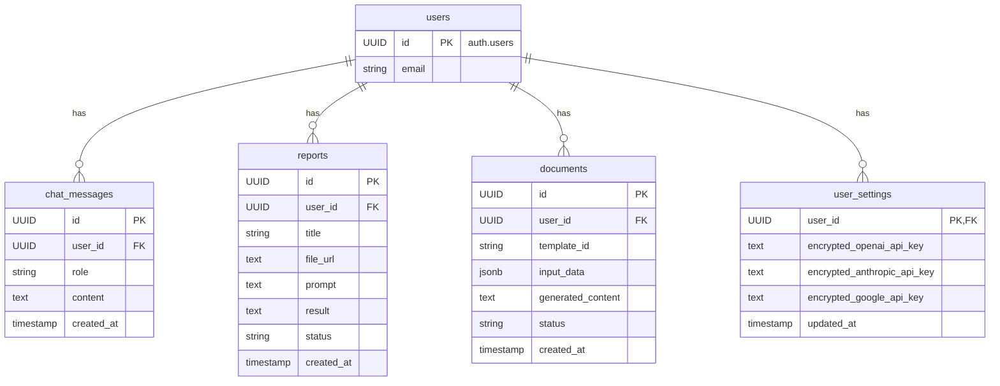

# ツミキリ — 技術アーキテクチャ設計書

- **作成者**: CTO マルコ・ロッシ
- **日付**: 2026-02-15
- **ステータス**: v1.0 策定完了

## 1. 概要

本ドキュメントは、TOPPA Inc.の最初のプロダクト「ツミキリ」の技術アーキテクチャを定義するものです。全社技術方針書 (`docs/tech-direction.md`) を基礎とし、ツミキリ固有の要件を反映しています。Founding Engineer カルロス・メンデス作成の `docs/implementation-plan.md` をレビューし、その内容を正式なアーキテクチャとして承認・統合しています。

## 2. システム構成図

ツミキリのアーキテクチャは、全社技術方針に基づき、Cloudflareのエッジコンピューティングを最大限に活用し、高速かつスケーラブルなサービスを提供します。

```mermaid
graph TD
    subgraph "ユーザー"
        A[ブラウザ<br>(React SPA)]
    end

    subgraph "Cloudflare Edge"
        B[Cloudflare Pages<br>(静的ホスティング)]
        C[Cloudflare Workers<br>(Hono API)]
    end

    subgraph "BaaS (Supabase)"
        D[Supabase Auth<br>(認証)]
        E[Supabase DB<br>(PostgreSQL + RLS)]
        F[Supabase Storage<br>(ファイルアップロード)]
    end

    subgraph "AI Providers"
        G[OpenAI / Anthropic / Google]
    end

    A -- "Webサイトアクセス" --> B
    A -- "APIリクエスト<br>(/api/*)" --> C
    C -- "認証" --> D
    C -- "DBアクセス" --> E
    C -- "ファイル操作" --> F
    C -- "AIリクエスト<br>(BYOK or Managed)" --> G
```

## 3. 技術スタック

全社技術方針書 (`docs/tech-direction.md`) に記載の技術スタックを全面的に採用します。

| カテゴリ | 技術 | 備考 |
|---|---|---|
| フロントエンド | React 19, TypeScript, Vite, Tailwind CSS | 全社方針通り |
| バックエンド | Cloudflare Workers, Hono | 全社方針通り |
| データベース | Supabase (PostgreSQL) | 全社方針通り |
| 認証 | Supabase Auth | 全社方針通り |
| ファイルストレージ | Supabase Storage | レポート機能のファイルアップロード用 |
| AI | OpenAI, Anthropic, Google | BYOK方式を主軸とする |
| CI/CD | GitHub Actions, Cloudflare Wrangler | 全社方針通り |

## 4. データモデル

Founding Engineerが設計したスキーマを承認し、ユーザーごとのAPIキーを管理する `user_settings` テーブルを追加します。



## 5. API設計

Founding Engineerの提案を基に、認証要件を明記したAPIエンドポイントを以下に定義します。

| 機能 | エンドポイント | Method | 認証 | リクエストボディ | レスポンス |
|---|---|---|---|---|---|
| **チャット** | `/api/chat` | POST | 必須 | `{ "message": "string" }` | `{ "reply": "string" }` |
| | `/api/chat/history` | GET | 必須 | - | `[{...}]` |
| **レポート生成** | `/api/report/upload` | POST | 必須 | `FormData (file)` | `{ "file_url": "string" }` |
| | `/api/report/generate` | POST | 必須 | `{ "file_url": "string", "prompt": "string" }` | `{ "report_id": "uuid" }` |
| | `/api/reports/:id` | GET | 必須 | - | `{ "status": "string", "result": "string" }` |
| | `/api/reports` | GET | 必須 | - | `[{...}]` |
| **書類生成** | `/api/document/generate` | POST | 必須 | `{ "template_id": "string", "data": {} }` | `{ "document_id": "uuid" }` |
| | `/api/documents/:id` | GET | 必須 | - | `{ "status": "string", "content": "string" }` |
| | `/api/documents` | GET | 必須 | - | `[{...}]` |
| **設定** | `/api/settings/api-keys` | PUT | 必須 | `{ "provider": "string", "api_key": "string" }` | `{ "success": true }` |

## 6. BYOK (Bring Your Own Key) 実装方針

ユーザーのAPIキーを安全に取り扱うため、以下の通り実装します。

1.  **保存**: ユーザーが入力したAPIキーは、Cloudflare Workers上で環境変数として保持するユニークな暗号化キーを用いて暗号化し、`user_settings` テーブルの各カラムに保存します。
2.  **利用**: ユーザーからのAIリクエスト時に、Workersは該当ユーザーの暗号化されたAPIキーをDBから取得し、メモリ上で復号してAIプロバイダーへのリクエストに使用します。
3.  **破棄**: APIキーはリクエスト完了後、メモリ上から即座に破棄します。ログには一切記録しません。
4.  **管理**: ユーザーはいつでもWeb UIから自分のAPIキーを更新・削除できます。

## 7. セキュリティ要件

全社技術方針に加え、ツミキリ固有のセキュリティ対策を徹底します。

| 脅威 | 対策 | 担当 |
|---|---|---|
| **SQLインジェクション** | Supabaseクライアントライブラリを使用し、直接のSQLクエリ発行を禁止。RLSを徹底。 | Engineer |
| **XSS / CSRF** | Reactの標準機能とHonoのセキュリティミドルウェアで対策。 | Engineer |
| **不正なファイルアップロード** | Supabase Storageのポリシーでファイル種別（CSV, XLSX）とサイズ（上限10MB）を制限。サーバーサイドで再度バリデーションを実施。 | Engineer |
| **プロンプトインジェクション** | システムプロンプトに防御指示を組み込む。ユーザー入力を明確に区切り、LLMにコンテキストを誤認させない工夫を施す。 | Engineer / PdM |
| **APIキー漏洩** | Cloudflare Workersのシークレット管理機能で暗号化キーを保護。DBへのアクセスはRLSで制限。 | CTO / Engineer |
| **サービス妨害 (DoS)** | Cloudflareのレート制限機能をAPIエンドポイントに適用（例: 1分あたり10リクエスト）。 | CTO |

## 8. 開発・テスト戦略

Founding Engineerが策定した `docs/implementation-plan.md` のテスト戦略を全面的に承認します。

- **ユニットテスト**: Vitest (カバレッジ目標 80%)
- **E2Eテスト**: Playwright (主要3フロー)
- **レビュープロセス**: 全てのコードは、`feature/*` ブランチから `develop` ブランチへのPull Requestを通じて、CTO（マルコ・ロッシ）のレビューを必須とします。

## 9. 次のステップ

| アクション | 担当 | 期限 |
|---|---|---|
| PdMの仕様書 (`mvp-spec.md`) との技術的整合性確認 | CTO (マルコ) | 2026-02-16 |
| 認証機能の実装開始 | Engineer (カルロス) | 2026-02-16 |
| APIの OpenAPI (Swagger) 定義作成 | CTO (マルコ) | 2026-02-17 |
