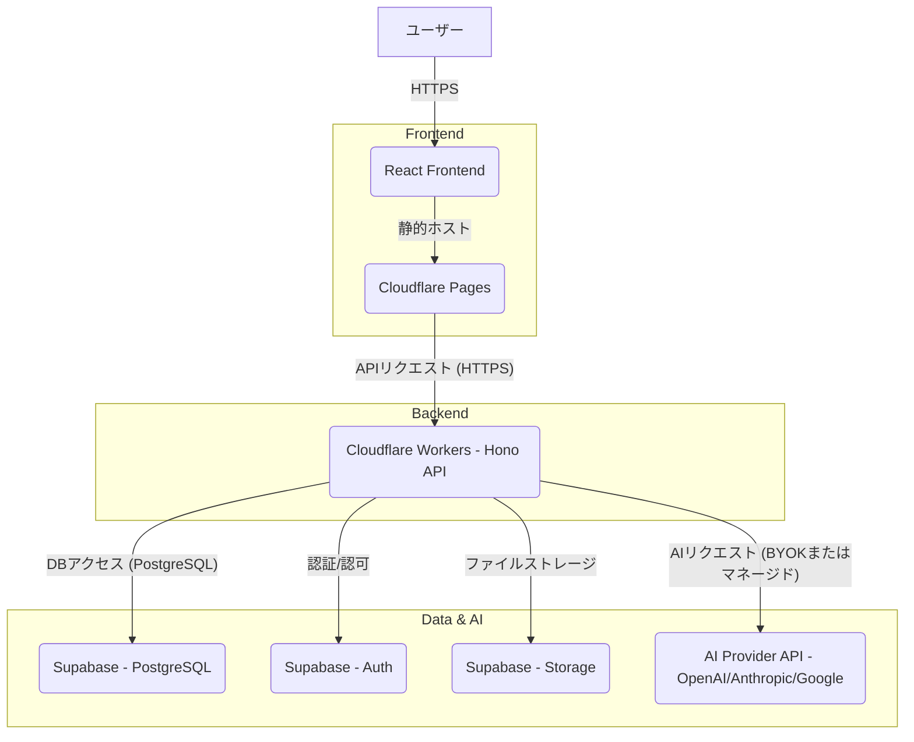

# ツミキリ 技術アーキテクチャ設計書

> 作成: CTO マルコ・ロッシ
> 日付: 2026-02-16
> ステータス: ドラフト

## 1. システム構成図



## 2. API設計（エンドポイント一覧）

ツミキリプロダクトの主要なAPIエンドポイントは以下の通り。

| エンドポイント | Method | 機能 | 備考 |
|---------------|--------|------|------|
| `/api/chat` | POST | チャット送信・AI応答取得 | 会話履歴をSupabaseに保存 |
| `/api/chat/history` | GET | 会話履歴取得 | ユーザーIDでフィルタリング |
| `/api/chat/history/:sessionId` | GET | 特定セッションの履歴取得 | 特定の会話セッションIDでフィルタリング |
| `/api/report/generate` | POST | レポート生成 | ファイルアップロードとAI分析指示を受け付け、レポートを生成 |

## 3. BYOK (Bring Your Own Key) 実装方針

ユーザーが自身のAIプロバイダーAPIキーを利用できるBYOK方式をサポートする。

-   **キーの管理**: ユーザーのAPIキーはCloudflare Workersのシークレット管理機能を利用して安全に保存・管理する。
-   **一時利用**: ユーザーのAPIキーはサーバーサイドでAIプロバイダーへのリクエスト時に一時的に利用し、ログには記録せず、リクエスト完了後メモリから破棄する。
-   **暗号化**: 保存されるAPIキーは暗号化して管理し、ユーザーごとに完全に分離する。

## 4. セキュリティ要件

-   **通信の暗号化**: 全ての通信はTLS 1.3により暗号化され、傍受や改ざんから保護される。Cloudflareの標準機能を利用。
-   **保存データの保護**: SupabaseのPostgreSQLに保存されるデータはAES-256により暗号化される。
-   **認証・認可**:
    -   ユーザー認証はSupabase Authを利用し、メールアドレス/パスワード認証およびソーシャルログインをサポートする。
    -   認可にはSupabaseのRow Level Security (RLS) を活用し、ユーザーが自身のデータのみにアクセスできることを保証する。
    -   APIキーはユーザーごとに分離し、厳格なアクセス制御を適用する。
-   **脆弱性対策**:
    -   OWASP Top 10を考慮したWebアプリケーションの設計・実装を行う。
    -   定期的なセキュリティレビューと脆弱性スキャンを実施する。

## 5. データベーススキーマ（主要テーブル）

Founding Engineerの実装計画に基づき、主要なデータベーススキーマ案を提示する。

### `chat_messages` テーブル

会話履歴を保存する。

```sql
CREATE TABLE chat_messages (
    id UUID PRIMARY KEY DEFAULT gen_random_uuid(),
    user_id UUID REFERENCES auth.users(id) ON DELETE CASCADE,
    role VARCHAR(10) NOT NULL CHECK (role IN ('user', 'assistant', 'system')),
    content TEXT NOT NULL,
    created_at TIMESTAMPTZ DEFAULT NOW()
);

-- RLS有効化とポリシー設定
ALTER TABLE chat_messages ENABLE ROW LEVEL SECURITY;
CREATE POLICY "Users can view own messages"
    ON chat_messages FOR SELECT
    USING (auth.uid() = user_id);
CREATE POLICY "Users can insert own messages"
    ON chat_messages FOR INSERT
    WITH CHECK (auth.uid() = user_id);
```

### `reports` テーブル

AIレポート生成機能で生成されたレポートの履歴を保存する。

```sql
CREATE TABLE reports (
    id UUID PRIMARY KEY DEFAULT gen_random_uuid(),
    user_id UUID REFERENCES auth.users(id) ON DELETE CASCADE,
    title VARCHAR(255) NOT NULL,
    file_name VARCHAR(255),
    file_url TEXT,
    prompt TEXT NOT NULL,
    result TEXT,
    created_at TIMESTAMPTZ DEFAULT NOW()
);

-- RLS有効化とポリシー設定
ALTER TABLE reports ENABLE ROW LEVEL SECURITY;
CREATE POLICY "Users can view own reports"
    ON reports FOR SELECT
    USING (auth.uid() = user_id);
CREATE POLICY "Users can insert own reports"
    ON reports FOR INSERT
    WITH CHECK (auth.uid() = user_id);
```