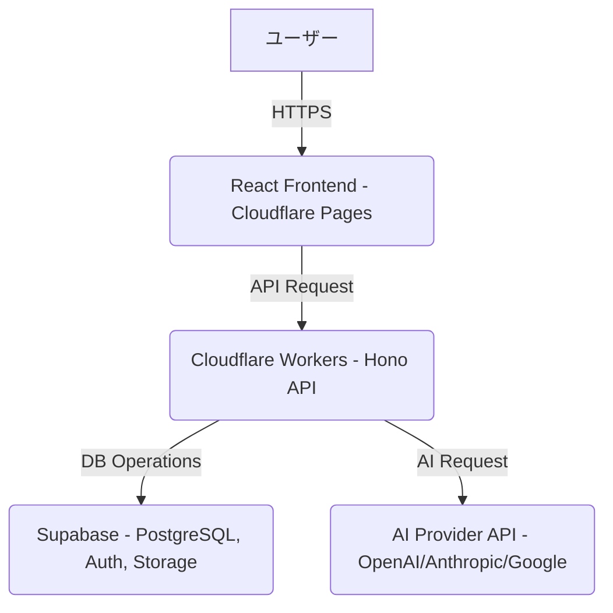
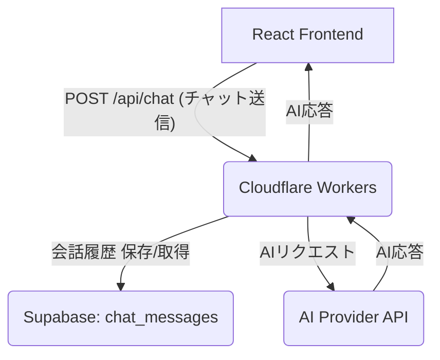
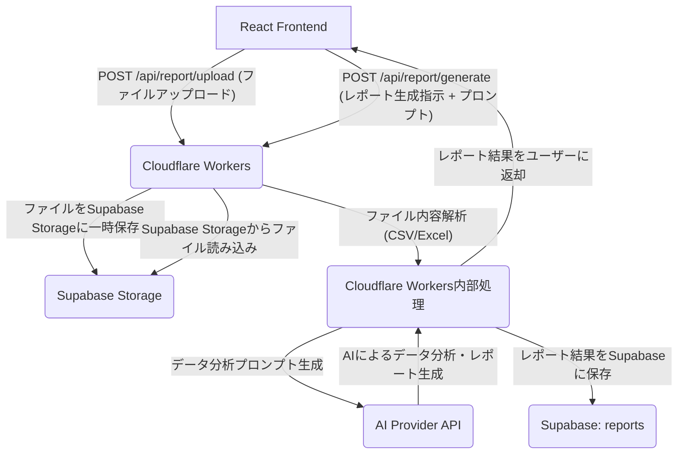

# ツミキリ 技術アーキテクチャ設計書

> 作成: CTO マルコ・ロッシ
> 日付: 2026-02-16
> ステータス: ドラフト作成完了
> レビュー: CEO 高橋レン

## 1. 概要

本ドキュメントは、TOPPA Inc. の第1弾プロダクトである「ツミキリ」の技術アーキテクチャ設計を定義する。PdMのプロダクト仕様書とFounding Engineerの実装計画に基づき、システム構成、API設計、BYOK実装方針、セキュリティ要件を明確にする。

## 2. システム構成

ツミキリは、フロントエンドにReact、バックエンドにCloudflare Workers、データベースにSupabase、AIプロバイダーとしてOpenAI/Anthropic/Google APIを使用する。

### 2.1. チャットアシスタント機能のシステム構成

### 2.2. AIレポート生成機能のシステム構成

Founding Engineerの進捗に基づき、ファイルアップロードからレポート生成までの詳細フローを以下に示す。

## 3. API設計

Founding Engineerの実装計画に基づき、主要なAPIエンドポイントを定義する。

### 3.1. 認証・認可関連API

| エンドポイント | Method | 機能 | 認証要件 |
|---------------|--------|------|----------|
| `/api/auth/login` | POST | ユーザーログイン | なし |
| `/api/auth/register` | POST | ユーザー登録 | なし |
| `/api/auth/logout` | POST | ユーザーログアウト | ログイン必須 |
| `/api/auth/refresh-token` | POST | トークン更新 | ログイン必須 |

### 3.2. チャットアシスタント関連API

| エンドポイント | Method | 機能 | 認証要件 |
|---------------|--------|------|----------|
| `/api/chat` | POST | チャット送信・AI応答取得 | ログイン必須 |
| `/api/chat/history` | GET | 会話履歴取得 | ログイン必須 |
| `/api/chat/history/:sessionId` | GET | 特定セッションの履歴取得 | ログイン必須 |

### 3.3. AIレポート生成関連API

| エンドポイント | Method | 機能 | 認証要件 | リクエストボディ（例） | レスポンスボディ（例） |
|---------------|--------|------|----------|------------------------|------------------------|
| `/api/report/upload` | POST | ファイルアップロード（Supabase Storageへ一時保存）。CSV/Excel形式のファイルを想定。 | ログイン必須 | `FormData` にファイルデータ | `{"fileId": "uuid-...", "fileName": "example.csv"}` |
| `/api/report/generate` | POST | レポート生成指示。アップロードされたファイルを解析し、AIへ分析指示を送信。AIからの結果を整形し、Supabaseに保存後、ユーザーに返却。 | ログイン必須 | `{"fileId": "uuid-...", "prompt": "先月の売上を分析して"}` | `{"reportId": "uuid-...", "title": "売上分析レポート", "summary": "...", "content": "..."}` |
| `/api/report/history` | GET | レポート履歴取得 | ログイン必須 | なし | `[{"reportId": "uuid-...", "title": "...", "createdAt": "..."}]` |
| `/api/report/history/:reportId` | GET | 特定レポート取得 | ログイン必須 | なし | `{"reportId": "uuid-...", "title": "...", "content": "..."}` |
| `/api/report/download/:reportId` | GET | レポート結果ダウンロード（PDF/Markdown形式） | ログイン必須 | なし | レポートファイル（バイナリデータ） |

## 4. BYOK (Bring Your Own Key) 実装方針

ユーザーは自身のAIプロバイダーAPIキーを登録し、ツミキリのAI機能を利用できる。

- **APIキーの登録**: ユーザーが設定画面でAPIキーを登録。Supabaseの暗号化されたカラムに保存する。
- **キーの利用**: Cloudflare Workersがリクエスト時にSupabaseからAPIキーを取得し、AIプロバイダーへのリクエストヘッダに設定。
- **セキュリティ**:
    - APIキーはサーバーサイドで一時利用のみとし、ログには記録しない。
    - リクエスト完了後、メモリから即座に破棄する。
    - ユーザーのAPIキーは、そのユーザーのリクエストのみに利用されることを保証する。

## 5. セキュリティ要件

### 5.1. データ保護

- **通信**: TLS 1.3（Cloudflare標準）による暗号化。
- **保存データ**: Supabaseによるデータ暗号化（AES-256）。特に、アップロードされたファイルはSupabase Storageに保存され、ユーザーごとのアクセス制御（Row Level Security）を適用する。
- **APIキー**: Cloudflare Workersのシークレット管理とSupabaseの暗号化カラムを併用し、厳重に保護する。

### 5.2. 認証・認可

- **ユーザー認証**: Supabase Auth（メールアドレス、ソーシャルログイン）を利用。
- **データアクセス制御**: SupabaseのRow Level Security (RLS) により、ユーザーは自身のデータ（チャット履歴、レポート、アップロードファイル）のみアクセス可能とする。
- **APIキーの分離**: BYOKで登録されたAPIキーは、各ユーザーのデータ処理のみに利用され、他のユーザーのデータにはアクセスできないようにする。

### 5.3. ファイルアップロードのセキュリティ

- **ファイルサイズ制限**: Cloudflare Workersでファイルサイズを制限し、サービス停止攻撃（DoS）を防止する。
- **ファイルタイプ検証**: アップロード時に許容されるファイルタイプ（例: .csv, .xlsx）を厳密に検証し、不正なファイルのアップロードを防ぐ。
- **ウイルススキャン**: 将来的には、アップロードされたファイルに対してウイルススキャンを導入することを検討する（Q2以降）。
- **一時保存**: アップロードされたファイルはSupabase Storageに一時的に保存され、処理完了後は一定期間後に自動削除、またはユーザーが手動で削除できる機能を提供する。

## 6. パフォーマンス要件

| 指標 | 目標値 |
|------|--------|
| 初期ロード | 2秒以内（LCP） |
| チャット応答 | 3秒以内（AI応答含む） |
| レポート生成 | 10秒以内（CSV 1000行まで） |
| 書類生成 | 5秒以内 |

## 7. 将来の技術拡張（Q2以降の検討事項）

- **音声入力**: Web Speech API → 自然言語指示
- **モバイルアプリ**: PWA対応（インストール不要）
- **Webhook連携**: 外部サービスとの自動連携
- **マルチテナント**: 企業ごとのデータ完全分離

## 8. 技術的リスクと対策

| リスク | 対策 |
|--------|------|
| AI応答の品質ばらつき | プロンプトエンジニアリングの強化、AIモデルの複数利用、ユーザーによるフィードバック機能 |
| AIプロバイダーのサービス停止 | 複数のAIプロバイダーをバックアップとして確保、自動切り替え機能の検討 |
| データ漏洩（BYOK） | APIキーの厳重な管理、RLSの徹底、定期的なセキュリティ監査 |
| ファイルアップロードの脆弱性 | ファイルタイプ/サイズ制限、ウイルススキャン導入（将来）、WAFによる保護 |
| Cloudflare Workersの制限 | Edge Functionsの最適化、大規模データ処理はバッチ処理にオフロード検討 |
