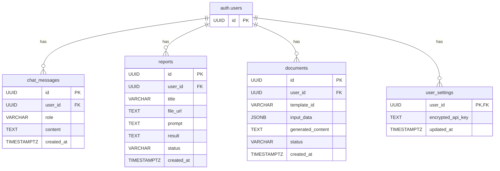

# ツミキリ（Tsumikiri）技術アーキテクチャ設計書

> 作成者: CTO マルコ・ロッシ
> 日付: 2026-02-15
> ステータス: ドラフト

## 1. 概要

本ドキュメントは、中小企業向け事務作業自動化AI「ツミキリ」の技術アーキテクチャを定義するものです。Q1計画で定められたMVP（Minimum Viable Product）の実現を目的とします。

**関連ドキュメント:**
- [TOPPA Inc. 技術方針書](docs/tech-direction.md)
- [ツミキリ MVP実装計画](docs/implementation-plan.md)

## 2. システム構成図

全体構成は、全社技術方針に基づき、Cloudflareを中心としたサーバーレスアーキテクチャを採用します。

```mermaid
graph TD
    subgraph "ユーザー"
        A[ブラウザ<br>(React SPA)]
    end

    subgraph "Cloudflare"
        B[Cloudflare Pages<br>(Frontend Hosting)]
        C[Cloudflare Workers<br>(Backend API / Hono)]
    end

    subgraph "Supabase (IaaS)"
        D[Supabase Auth<br>(認証)]
        E[Supabase DB<br>(PostgreSQL)]
        F[Supabase Storage<br>(ファイルストレージ)]
    end

    subgraph "外部AIサービス"
        G[AI Provider API<br>(OpenAI / Anthropic / Google)]
    end

    A -- HTTPS --> B
    A -- APIリクエスト --> C
    C -- 認証 --> D
    C -- DBアクセス --> E
    C -- ファイル操作 --> F
    C -- AIリクエスト<br>(BYOK/マネージド) --> G
```

## 3. データベース設計

Founding Engineer カルロス・メンデスによる実装計画のDBスキーマ案を承認し、正式な設計として採用します。

### ER図



### テーブル定義

| テーブル名 | 用途 | RLS |
|---|---|---|
| `chat_messages` | チャット履歴を保存 | 有効 |
| `reports` | AIレポート生成の履歴と結果を保存 | 有効 |
| `documents` | テンプレートからの書類生成履歴を保存 | 有効 |
| `user_settings` | ユーザー毎の設定（暗号化済みAPIキー等）を保存 | 有効 |

## 4. API設計

Founding Engineer カルロス・メンデスによる実装計画のAPIエンドポイント案をレビューし、以下の通り承認します。

### 認証 (`/api/auth`)
- Supabase Authを利用するため、バックエンドでの個別実装は不要。

### チャット (`/api/chat`)
| エンドポイント | Method | 機能 |
|---|---|---|
| `/api/chat` | POST | チャットメッセージを送信し、AIの応答を取得する。 |
| `/api/chat/history` | GET | ログインユーザーの会話履歴を取得する。 |

### レポート生成 (`/api/report`)
| エンドポイント | Method | 機能 |
|---|---|---|
| `/api/report/upload` | POST | 分析対象のファイル（CSV/Excel）をSupabase Storageにアップロードする。 |
| `/api/report/generate` | POST | アップロード済みファイルと自然言語指示に基づき、レポート生成を非同期で要求する。 |
| `/api/report/:id` | GET | 特定のレポートのステータスと結果を取得する。 |
| `/api/report/list` | GET | ログインユーザーのレポート一覧を取得する。 |

### 書類生成 (`/api/document`)
| エンドポイント | Method | 機能 |
|---|---|---|
| `/api/document/generate` | POST | テンプレートIDと入力データに基づき、書類生成を非同期で要求する。 |
| `/api/document/:id` | GET | 特定の書類のステータスと結果を取得する。 |
| `/api/document/list` | GET | ログインユーザーの生成書類一覧を取得する。 |

## 5. BYOK (Bring Your Own Key) 実装方針

1.  **APIキーの保存**:
    - ユーザーが入力した外部AIサービスのAPIキーは、Cloudflare Workersのシークレット機能を利用して暗号化し、`user_settings`テーブルの`encrypted_api_key`カラムに保存する。
    - 暗号化・復号キーはWorkersのシークレットとして厳重に管理し、コードにはハードコードしない。
2.  **APIキーの利用**:
    - AI Providerへのリクエスト時に、該当ユーザーの暗号化済みAPIキーをデータベースから取得し、サーバーサイドで復号する。
    - 復号したAPIキーをリクエストヘッダーに含めて外部APIを呼び出す。
    - APIキーはリクエスト完了後、速やかにメモリから破棄する。ログには一切記録しない。
3.  **セキュリティ**:
    - フロントエンドとAPIサーバー間の通信はTLSで暗号化する。
    - データベースに保存するAPIキーは必ず暗号化する。

## 6. セキュリティ要件

全社技術方針書に加え、ツミキリ独自の要件を以下に定める。

| 項目 | 要件 | 実装方法 |
|---|---|---|
| **データ分離** | ユーザーは自身のデータ（チャット履歴、レポート等）にのみアクセス可能であること。 | SupabaseのRow Level Security (RLS) を全テーブルで有効化する。 |
| **ファイルアップロード** | 不正なファイル形式やサイズの大きいファイルのアップロードを防止すること。 | Cloudflare Workersでファイル形式（CSV, XLSX）とサイズ（上限10MB）を検証する。 |
| **APIキー保護** | ユーザーのAPIキーが漏洩しないこと。 | 上記「BYOK実装方針」に従い、暗号化して保存し、利用後は即時破棄する。 |
| **レート制限** | APIエンドポイントへの過剰なリクエストを防止すること。 | Cloudflareのレート制限機能を利用し、ユーザー毎・IPアドレス毎のアクセス頻度を制限する（例: 1分あたり60リクエスト）。 |

## 7. 次のステップ

| タスク | 担当 | 期限 |
|---|---|---|
| 本設計書に基づくバックエンドAPIのプロトタイプ実装 | カルロス・メンデス | 2026-02-18 |
| 本設計書に関するレビューとフィードバック | CEO 高橋レン | 2026-02-16 |
| セキュリティ要件チェックリストの作成 | マルコ・ロッシ | 2026-02-17 |
