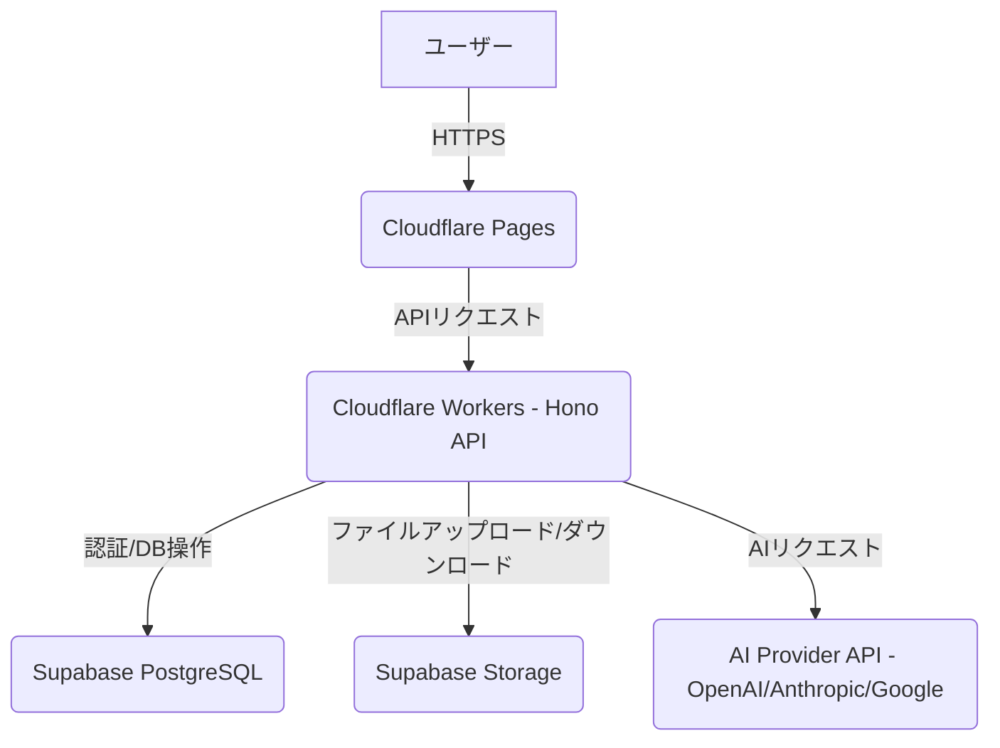

# ツミキリ 技術アーキテクチャ設計書

> 作成: CTO マルコ・ロッシ
> 日付: 2026-02-16
> ステータス: 更新済み（AIレポート機能進捗反映）

## 1. システム構成

ツミキリのシステム構成は、高速性、スケーラビリティ、開発効率を重視し、CloudflareとSupabaseを基盤とするサーバーレスアーキテクチャを採用する。Founding Engineerの進捗に基づき、AIレポート生成機能におけるSupabase Storageとの連携を強化する。

## 2. API設計

Cloudflare Workers (Hono) を用いて、以下のAPIエンドポイントを提供する。Founding Engineerの実装計画と進捗に基づき、チャット、レポート生成、テンプレート書類生成の各機能に対応する。

### 2-1. チャットアシスタントAPI

| エンドポイント | Method | 機能 | 備考 |
|---------------|--------|------|------|
| `/api/chat` | POST | チャット送信・AI応答取得 | ユーザーからのメッセージをAIに渡し、応答を返す。会話履歴はSupabaseに保存。 |
| `/api/chat/history` | GET | 会話履歴取得 | ログインユーザーの全会話履歴を取得。 |
| `/api/chat/history/:sessionId` | GET | 特定セッションの履歴取得 | 特定のチャットセッションの会話履歴を取得。 |

### 2-2. AIレポート生成API

Founding EngineerによりAIレポート生成機能の実装が開始され、Supabase Storageのバケット作成とRLS設定が完了した。これに伴い、ファイルアップロードのエンドポイントと、それに関連するストレージ連携を明確にする。

| エンドポイント | Method | 機能 | 備考 |
|---------------|--------|------|------|
| `/api/report/upload` | POST | ファイルアップロード | CSV/ExcelファイルをSupabase Storageに一時保存。 |
| `/api/report/generate` | POST | レポート生成 | アップロードされたファイルを指定し、自然言語の指示に基づきAIが分析・レポート生成。 |
| `/api/report/history` | GET | レポート履歴取得 | ログインユーザーの全レポート生成履歴を取得。 |
| `/api/report/:reportId` | GET | 特定レポート詳細取得 | 特定のレポートの詳細と生成結果を取得。 |
| `/api/report/:reportId/download` | GET | レポート結果ダウンロード | 生成されたレポート結果（PDF/Markdownなど）をダウンロード。 |

### 2-3. テンプレート書類生成API

| エンドポイント | Method | 機能 | 備考 |
|---------------|--------|------|------|
| `/api/document/generate` | POST | 書類生成 | テンプレートと入力データに基づき、AIが見積書や請求書などの書類を生成。 |
| `/api/document/templates` | GET | テンプレート一覧取得 | 利用可能な書類テンプレートの一覧を取得。 |
| `/api/document/history` | GET | 書類生成履歴取得 | ログインユーザーの全書類生成履歴を取得。 |
| `/api/document/:documentId` | GET | 特定書類詳細取得 | 特定の書類の詳細と生成結果を取得。 |

## 3. BYOK (Bring Your Own Key) 実装方針

ユーザーが自身のAIプロバイダーAPIキー（OpenAI, Anthropic, Google）を使用できるBYOK方式をサポートする。

-   **キーの保存**: ユーザーから提供されたAPIキーは、Supabaseの暗号化されたカラムに安全に保存される。各キーはユーザーIDと紐付けられ、Row Level Security (RLS) により他のユーザーからはアクセスできないようにする。
-   **キーの利用**: APIリクエスト時にサーバーサイドで一時的にメモリにロードし、AIプロバイダーへのリクエストに利用する。リクエスト完了後、メモリから即座に破棄される。ログには記録しない。
-   **バリデーション**: ユーザーがAPIキーを登録する際に、そのキーが有効であるか、および利用可能なモデルにアクセスできるかを検証する。

## 4. セキュリティ要件

TOPPA Inc.の技術方針書に基づき、以下のセキュリティ要件を遵守する。Founding EngineerによるSupabase StorageのRLS設定の進捗を反映する。

### 4-1. データ保護

-   **通信**: 全ての通信はTLS 1.3（Cloudflare標準）で暗号化される。
-   **保存データ**: Supabase PostgreSQLに保存されるデータはAES-256で暗号化される。
-   **APIキー**: Cloudflare Workersのシークレット管理機能を利用し、機密性の高いAPIキーを保護する。ユーザーのBYOKキーはSupabaseで暗号化して保存。

### 4-2. 認証・認可

-   **ユーザー認証**: Supabase Auth（メールアドレス/パスワード、ソーシャルログイン）を利用し、堅牢な認証機能を提供する。
-   **Row Level Security (RLS)**: SupabaseのRLSを全面的に活用し、ユーザーが自身のデータのみにアクセスできることを保証する。
    -   **`chat_messages` テーブル**:
        -   `CREATE POLICY "Users can view own messages" ON chat_messages FOR SELECT USING (auth.uid() = user_id);`
        -   `CREATE POLICY "Users can insert own messages" ON chat_messages FOR INSERT WITH CHECK (auth.uid() = user_id);`
    -   **`reports` テーブル**:
        -   `CREATE POLICY "Users can view own reports" ON reports FOR SELECT USING (auth.uid() = user_id);`
        -   `CREATE POLICY "Users can insert own reports" ON reports FOR INSERT WITH CHECK (auth.uid() = user_id);`
    -   **Supabase Storage**:
        -   Founding Engineerにより、認証済みユーザーが自身のファイルをアップロード・ダウンロード・削除できるRLSポリシーが設定済み。具体的には、バケットポリシーにより、ユーザーIDに基づいてアクセスが制限される。
-   **APIキーの認可**: ユーザーのBYOKキーは、そのユーザーのリクエストにのみ使用を許可する。

### 4-3. BYOK セキュリティ

-   ユーザーのAPIキーはサーバーサイドで一時利用のみ。
-   ログには記録しない。
-   リクエスト完了後メモリから破棄。

## 5. 開発規約

### 5-1. コード品質

-   TypeScript strict mode 必須。
-   ESLint + Prettier による自動フォーマット。
-   全関数にJSDocコメント（経営者向けプロダクトなので保守性重視）。

### 5-2. テスト

-   ユニットテスト: Vitest（カバレッジ80%目標）。
-   E2Eテスト: Playwright（主要フロー3つ）。
-   AI応答テスト: モックAPIでの動作検証。

### 5-3. ブランチ戦略

-   `main`: 本番環境（自動デプロイ）。
-   `develop`: 開発統合ブランチ。
-   `feature/*`: 機能開発ブランチ。
-   PR必須、CTOレビュー後にマージ。

### 5-4. コミットメッセージ

-   AGENTS.md準拠: `[ロール名] 内容`。
-   例: `[Engineer] CSVアップロード機能を実装`。

## 6. パフォーマンス要件

| 指標 | 目標値 |
|------|--------|
| 初期ロード | 2秒以内（LCP） |
| チャット応答 | 3秒以内（AI応答含む） |
| レポート生成 | 10秒以内（CSV 1000行まで） |
| 書類生成 | 5秒以内 |

## 7. 将来の技術拡張（Q2以降の検討事項）

-   **音声入力**: Web Speech API → 自然言語指示。
-   **モバイルアプリ**: PWA対応（インストール不要）。
-   **Webhook連携**: 外部サービスとの自動連携。
-   **マルチテナント**: 企業ごとのデータ完全分離。
