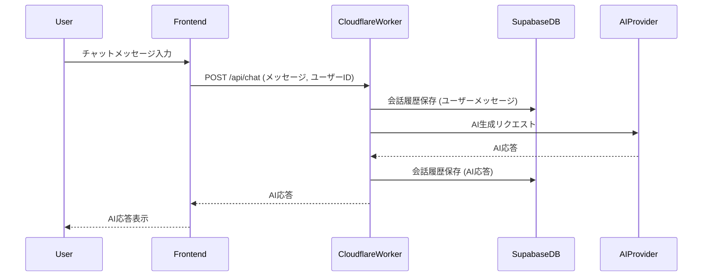
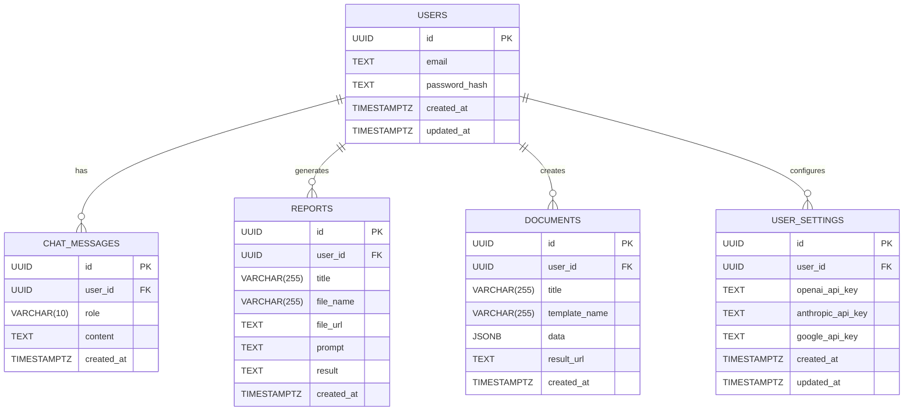

# TOPPA Inc. ツミキリ MVP 技術アーキテクチャ設計書

> 作成: CTO マルコ・ロッシ
> 日付: 2026-02-15
> ステータス: 設計中

## 1. システム構成

```mermaid
graph TD
    A[ブラウザ (React SPA)] -- APIリクエスト --> B(Cloudflare Pages)
    B -- 静的ホスティング --> C(Cloudflare Workers)
    C -- APIエンドポイント --> D(Hono API)
    D -- DBアクセス --> E(Supabase PostgreSQL)
    D -- AIリクエスト --> F(AI Provider API)
    E -- 認証/認可 --> G(Supabase Auth)
    E -- ストレージ --> H(Supabase Storage)
```

## 2. 技術スタック

- **フロントエンド**: React 19 + TypeScript + Vite, Tailwind CSS, Zustand, React Router
- **バックエンド**: Cloudflare Workers, Hono
- **データベース**: Supabase (PostgreSQL, Auth, Storage)
- **AI**: OpenAI (GPT-4o), Anthropic (Claude Sonnet 4.5), Google (Gemini 2.5 Pro) - BYOK方式またはマネージド方式
- **ホスティング**: Cloudflare Pages (フロントエンド), Cloudflare Workers (APIサーバー)
- **CI/CD**: GitHub Actions, Cloudflare Wrangler

## 3. API設計

### 3.1. エンドポイント一覧

| エンドポイント | Method | 機能 | 認証 |
|---|---|---|---|
| `/api/auth/login` | POST | ログイン | 不要 |
| `/api/auth/signup` | POST | サインアップ | 不要 |
| `/api/auth/logout` | POST | ログアウト | 必要 |
| `/api/user/profile` | GET | ユーザープロファイル取得 | 必要 |
| `/api/user/profile` | PUT | ユーザープロファイル更新 | 必要 |
| `/api/chat` | POST | チャット送信・AI応答取得 | 必要 |
| `/api/chat/history` | GET | 会話履歴取得 | 必要 |
| `/api/chat/history/:sessionId` | GET | 特定セッションの履歴取得 | 必要 |
| `/api/report/generate` | POST | AIレポート生成 | 必要 |
| `/api/report/history` | GET | レポート履歴取得 | 必要 |
| `/api/report/:reportId` | GET | 特定レポート取得 | 必要 |
| `/api/document/generate` | POST | テンプレート書類生成 | 必要 |
| `/api/document/history` | GET | 生成済み書類履歴取得 | 必要 |
| `/api/document/:documentId` | GET | 特定書類取得 | 必要 |

### 3.2. APIフロー (チャット機能例)



## 4. データベース設計

### 4.1. 主要テーブル



### 4.2. Row Level Security (RLS)

- `chat_messages` テーブルには以下のポリシーを適用する。
    - SELECT: `auth.uid() = user_id` (ユーザーは自身のメッセージのみ閲覧可能)
    - INSERT: `auth.uid() = user_id` (ユーザーは自身のメッセージのみ挿入可能)
- 他のテーブル (`reports`, `documents`, `user_settings`) も同様に `user_id` を用いたRLSを適用し、データ分離を徹底する。

## 5. BYOK (Bring Your Own Key) 実装方針

- ユーザーのAPIキーはSupabaseの `user_settings` テーブルに暗号化して保存する。
- Cloudflare Workers経由でAI Provider APIにリクエスト時に一時的に復号し利用。
- リクエスト完了後、メモリから即座に破棄。ログには記録しない。

## 6. セキュリティ要件

- **通信**: TLS 1.3 (Cloudflare標準)
- **保存データ**: Supabase暗号化 (AES-256)
- **APIキー**: Cloudflare Workers のシークレット管理、Supabaseでの暗号化保存（`user_settings`テーブル）
- **認証・認可**: Supabase Auth (メール + ソーシャルログイン)、Row Level Security (RLS) を全ユーザーデータテーブルに適用
- **BYOK**: ユーザーAPIキーの一時利用、ログ不記録、メモリからの即時破棄を徹底

## 7. 開発・デプロイ

### 7.1. GitHubリポジトリ構成

- **リポジトリ名**: `toppa-inc/tsumikiri` (Private)
- **初期ブランチ構成**:
    - `main`: 本番環境（自動デプロイ）
    - `develop`: 開発統合ブランチ
    - `feature/*`: 機能開発ブランチ
- **ブランチ保護**: `main` ブランチへの直接pushは禁止。PR必須、CTOレビュー後にマージ。

### 7.2. 環境構築ファイル

Founding Engineerによって以下の環境構築ファイルが作成済み。これらをCI/CDおよび開発環境で活用する。

- `supabase/schema.sql`: DBスキーマ定義
- `.env.example`: 環境変数テンプレート
- `wrangler.toml`: Cloudflare Workers設定
- `package.json`: 依存関係定義
- `tsconfig.json`: TypeScript設定
- `tailwind.config.js`: Tailwind CSS設定
- `vite.config.ts`: Vite設定

### 7.3. CI/CD

- **GitHub Actions**: PR時にLint + Type Check + テストを実行。
- **Cloudflare Wrangler**: `main` ブランチマージ時に自動デプロイ。

## 8. 検討事項

- エラーハンドリングの詳細設計
- 監視・ロギング戦略
- 負荷試験計画
- ドキュメント生成機能におけるテンプレート管理の具体化 (Supabase Storageの活用)
